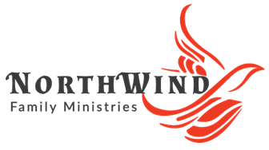

# NorthWind Family Ministries - Branding Assets

Welcome to the official branding repository for **NorthWind Family Ministries**.
This repository contains logos, icons, and other brand-related assets for use across internal and external platforms such as Microsoft 365, websites, email signatures, and third-party integrations.

---

## 🌐 Public Logo URLs

| Category    | Variant      | Preview                                                    | Direct Link                                                                                                                                  |
| ----------- | ------------ | ---------------------------------------------------------- | -------------------------------------------------------------------------------------------------------------------------------------------- |
| **Primary** | With Text    |  | [NorthWind-Logo-WithText.png](https://raw.githubusercontent.com/NorthWind-Family-Ministries/branding/main/logos/NorthWind-Logo-WithText.png) |
| **Primary** | Without Text |    | [NorthWind-Logo-NoText.png](https://raw.githubusercontent.com/NorthWind-Family-Ministries/branding/main/logos/NorthWind-Logo-NoText.png)     |

---

## 🌌 Fonts

The official brand font for **NorthWind Family Ministries** is:

| Element | Font     | Style   | Source Link                                                            |
| ------- | -------- | ------- | ---------------------------------------------------------------------- |
| Body    | PT Serif | Regular | [PT Serif on Google Fonts](https://fonts.google.com/specimen/PT+Serif) |

---

## 📁 Repository Structure

```
branding-assets/
├── logos/
│   ├── NorthWind-Logo-WithText.png
│   └── NorthWind-Logo-NoText.png
├── fonts/
│   └── font-references.md
├── colors/
│   └── brand-palette.md
└── README.md
```

---

## 📌 License & Usage

All assets in this repository are the intellectual property of **NorthWind Family Ministries** and may not be used without permission outside official projects, partnerships, or brand-approved content.

---

## 📬 Contact

For custom asset requests, licensing, or integration help, contact:
[info@northwindfm.org](mailto:info@northwindfm.org)
